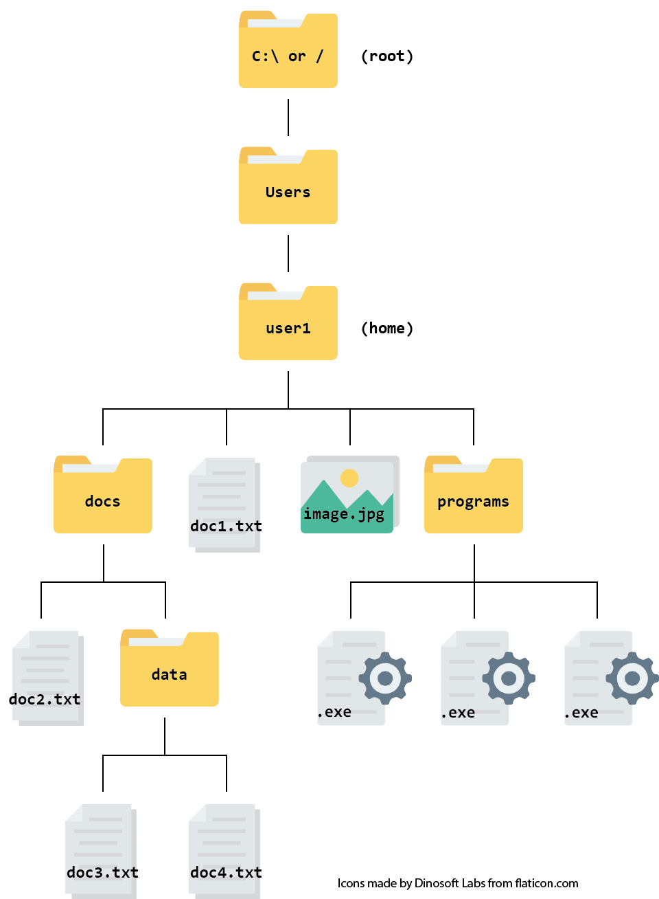

```{r setup, include=FALSE}
library(learnr)
knitr::opts_chunk$set(echo = FALSE)
```

```{r out.width = "100px", fig.alt = "cloud-SPAN logo"}
knitr::include_graphics("images/transparent-cloud-only.PNG")
```


## Why?

The [Cloud-SPAN Genomics course](https://cloud-span.york.ac.uk/train-with-us#genomicscourse) teaches data management and analysis for genomics research including:

-   best practices for organization of bioinformatics projects and data,
-   use of command-line utilities to connect to and use cloud computing.
-   use of command-line tools for data preparation and,
-   use of command-line tools to analyse sequence quality and perform variant calling.

We have found that people taking the Genomics course can vary the amount of experience they have had in navigating file systems and using the command line. We have designed the Prenomics course to allow more time for those with less experience to cover some foundation concepts. This self-assessment is intended to help you decide if you would benefit from attending Prenomics before the Genomics course.

You can take the quiz as many times as you like and you do not need to give the results before registering for our courses. The quiz is designed only to help you decide whether the Prenomics course would be useful for you and should take only a few minutes.

## Some general questions

```{r quiz}
quiz(caption = NULL,
     question("I can make a folder on my machine (Windows/Mac/Unix)",
              answer("Yes", 
                     correct = TRUE,
                     message = "You might not need the Prenomics course - see how you get on with the other questions."),
              answer("No"),
              answer("I am not sure"),
              incorrect = "In the Genomics course you will need to be able create folders on your machine and locate them. We teach you how to do this in Prenomics."),
     question("When I download a file from the internet or from an email, the file gets saved to:",
              answer("the browser"),
              answer("the Downloads folder", 
                     message = "The Downloads folder is set as the default location on many machines but you need to be able to chose the location."),
              answer("any folder I choose", 
                     correct = TRUE,
                     message = "You might not need the Prenomics course - see how you get on with the other questions."),
              answer("I am not sure"),
              incorrect = "In the Genomics course you will need to be able to save an emailed file to a particular folder and navigate to that folder. We teach you how to do this in Prenomics."
     ),
     
     question("Indicate all that are true",
              answer("directories are bigger than folders",
                     message = "* The words 'directory' and 'folder' are synonyms. Directory is used more often in programming and research computing."),
              answer("we usually have more than one working directory at a time",
                     message = "* You have only have one working directory at a time."),
              answer("a working directory of a process is the default location it will read and write from",
                     correct = TRUE),
              answer("current directory means the same as working directory", 
                     correct = TRUE),
              answer("a  path gives the location of a file or folder with a file system",
                     correct = TRUE),
              answer("a relative path gives the location of a file relative to the user's home directory",
                     message = "* A relative path gives the location of a file relative to the current working directory."),
              answer("a folder structure is most portable if all paths are absolute",
                     message = "* It is best to use relative paths."),
              correct = "You might not need the Prenomics course - see how you get on with the other questions.",
              incorrect = "We teach you about these topcs in Prenomics."
     )
)
```

## Navigating a file system


```{r out.width = "450px", fig.alt = "schematic of a hierachical file system with 6 levels. The top folder is marker 'c:/ or / (root)'; the second levels has one folder called 'Users', the third levels has one folder called 'user1', the fourth levels has two folders, 'docs' and 'programs' and two files 'doc1.txt' and 'image.jpg'. On the fifth level, the file 'doc2.txt' and folder 'data' are under 'docs' and three .exe files are under 'programs'. One the sixth level under 'data' are 'doc3.txt' and 'doc4.txt'"}

```


The following questions are based on the file system shown above.

```{r quiz-fs}
quiz(caption = NULL,
  question("The absolute path of `doc3.txt` is:",
           answer("`doc3.txt`"),
           answer(" `/Users/user1/docs/data/doc3.txt`",
                  correct = TRUE,
                  message = "You might not need the Prenomics course - see how you get on with the next one."),
           answer("`user1/docs/data/doc3`"),
           answer("`doc3.txt/data/docs/user1/Users/`"),
           answer("`C:/docs/doc3.txt`"),
           incorrect = "An absolute path is from the root directory - the top of the hierarchical file system."
  ),
  question("If your working directory is `programs` the relative path to `image.jpg` is:",
           answer("`./programs/image.jpg`"),
           answer("`../docs/image.jpg`"),
           answer("`../image.jpg`", 
                  correct = TRUE,
                  message = "You might not need the Prenomics course - see how you get on with the next one."),
           answer("`home/image.jpg`"),
           incorrect = "You need to go up a directory (`..`) which be into `user1/` to see `image.jpg`. If you've not seen `..` and `.` before, don't worry, we cover these in Prenomics!"
  ),
  question("If your working directory is `programs` the relative path to `doc2.txt` is:",
           answer("`doc2.txt/docs`"),
           answer("``../../docs/doc2.txt``"),
           answer("`../docs/doc2.txt`",
                  correct = TRUE,
                  message = "You might not need the Prenomics course - see how you get on with the next one."),
           answer(" ``programs/docs/doc2.txt``")
  ), 
  question("When working on the command line, `cd ..` means:",
           answer("go up a directory",
                  correct = TRUE,
                  message = "You might not need the Prenomics course - see how you get on with the next one."),    
           answer("move to the users home directory"),
           answer("close down the command line"),
           answer("cancel all (`..`) devices"),
           incorrect = "`cd` means change directory - in this case to the one above. We cover `cd`, `ls` and `pwd` in Prenomics."
  ),
  question("When working on the command line using the filesystem diagram above, if `pwd` displays `/Users/user1/programs` what will `ls docs/`  display?:",
           answer("`doc2.txt`  `data/`"),
           answer("`doc2.txt`  `doc3.txt`  `doc4.txt` "),
           answer("`doc1.txt`  `image.jpg`  `programs` "),
           answer(" `docs/: No such file or directory`", 
                  correct = TRUE),
           incorrect = "`pwd` means print working directory and `ls` means list. Since there is no `docs/` folder in the working directory, `ls` is not able to find it."
  )
)
```


## Finished!

If you got more than one or two of these wrong, we suggested attending our Prenomics Course.

- [Register here!](https://sites.google.com/york.ac.uk/cloud-span/train-with-us#h.87c8lxmy0dr3)
<!-- - [View course content](https://cloud-span.github.io/prenomics00-intro/) -->

See you soon!
